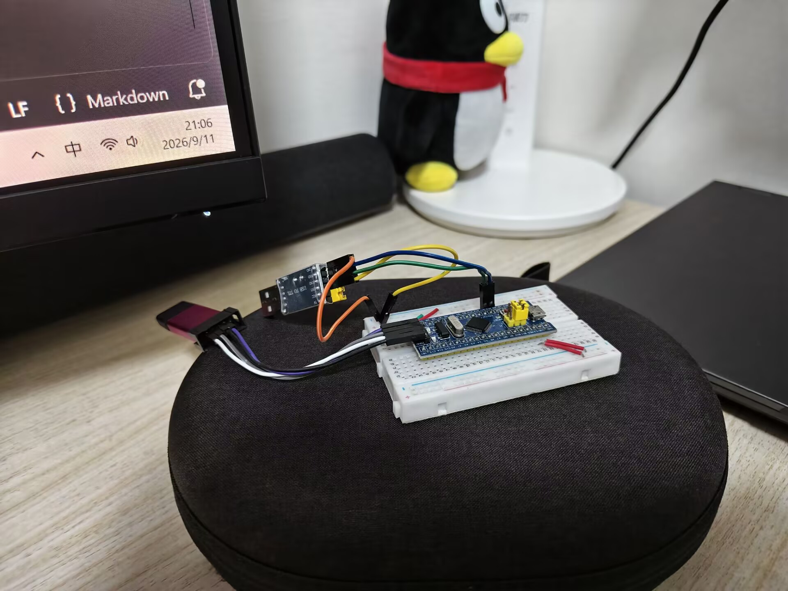

# 为什么是 C++，凭什么？

当然笔者不是C++的传销头子，也不希望大家成为一个工具的传销头子。

> "为什么是 C++，凭什么？大家都是C写欸，玩这么花能用嘛？"

这个是当时笔者被拉去说写一个好玩的项目培训比我们小一届的师弟师妹们时，我的好兄弟 @Dessera 跟我唠这个话题的时候，我的想法。笔者那个时候是传统派（伤心的是技艺稀烂的传统派），也深受刻板印象的说辞的影响：

我先立正，开始念经：

1. "单片机上用 C++？这么大的玩意你跑单片机？我看这个SRAM还是太便宜了"
2. "C++，你在C++上玩OOP？开销不玩死你，臭写固件的还刷上了"
3. "C++不如C好懂的，抓紧时间搞你的业务去，驱动写完了没哦？"（这个确实）

虽然笔者听到的是各种说辞的变体，也有可能屏幕前的各位就是冲进来准备嘲讽我这个。没事，这是正常的。实际上，Jacob Beningo 的嵌入式咨询团队引用行业调查说，C 至今驱动着全球超过六成的嵌入式项目<RefLink :id="1" preview="Beningo, The Best Embedded Programming Languages for Engineers Now, 2024" />；而 Amar Mahmutbegović 2025 年在 Packt 出的《C++ in Embedded Systems》，整本书第一章就叫 Debunking Common Myths，破的就是"C++ 代码膨胀、运行时有开销"这套流传了三十年的说法<RefLink :id="2" preview="Mahmutbegović, C++ in Embedded Systems, Packt, 2025, Ch.1" />——连专门写书破迷思的都有，可见这套说法流传得多广。

但是兄弟们，咱们这个教程就是偏偏不只是搬出来：“嘿你还有你老祖宗聪明”的，不是求证的态度学习。咱们呢，就是要把真正的横向比较放在这里，走下来一趟完整的，常见的嵌入式的器件驱动开发。走下来，用代码衡量，用数据说话，笔者认为这是一个做工程的人的态度。

## 快速冒个烟

**做工程的第零个事情是理清楚做什么和为什么做，第一个事情才是做他**，我们说完了第零个了，现在做第一个。

评估的第一步是说好前提，我们这里快速介绍一下，这样之后开始的时候，您可以愉快的决定如下的抉择：

1. 太棒了写这坨的作者居然刚好跟我用一个硬件和一个开发环境！让我看看他是不是在拿神秘的LLM糊弄我
2. 有硬件，但是只有Keil，我看看这个家伙到底打算怎么办
3. 笑死，不玩ST，再见了您

从而尽可能减少我真的在浪费您的时间。笔者的工作平台是这样的：Blue Pill（STM32F103C8T6，板载 LED 接 PC13，低电平点亮），和我的笔记本电脑。和一个可爱的扩展坞方便插上来。



笔者使用的编译器不是armcc，额，不考虑闭源的编译器，只是不喜欢用。所以我用的是 arm-none-eabi-gcc 16.1.0，统一 Release 构建（`-O3 -DNDEBUG`）。四份固件共用同一份骨架：`HAL_Init`、把时钟从内置 8 MHz 拉到 PLL 64 MHz、主循环里亮 500 毫秒灭 500 毫秒，延时都用 `HAL_Delay`。骨架一样，差异就只剩"怎么把引脚配成输出"和"怎么翻转它"。

> 如果您发现一些涉及到工具描述的内容，实在有一些令人费解，可以移步到起步站的[《工作环境》](03-toolchain-anatomy)补课，随时回来。

最基本的环境和我们采用的库的策略说完了。我们来说如何验证。

咱们的主角 libestdx 是一个公开仓库，一条命令拉下来（`--recursive` 会顺带把它依赖的 HAL 库一起拉齐），配好工具链之后两条命令就能构建：

```bash
git clone --recursive https://github.com/Charliechen114514/libestdx.git
cd libestdx

# 孩子们，要用我们秘制的cmake（难视
cmake -B build -G Ninja -DCMAKE_TOOLCHAIN_FILE=cmake/arch/stm32f103c8t6.cmake
cmake --build build
```

库自带的 `examples/` 里，`01_blinky` 是马上出场的一份实现的 HAL 版的近亲，`03_led` 是模板版的近亲，先跑起来眼熟一下就好。

> 你要传递优化级别嘛？懂行的朋友如是提问。
> A: 不用， 这条命令不用传优化级别：库的 CMake 里写死了没显式指定就默认 Release——一个号称零开销抽象的库，默认产物必须就是优化构建。除非开Debug要调试了。

咳咳，亮工程！大家都是杰出的工程师，不信任看不到的东西，咱们就把四份固件共用的骨架整个摆一遍，后面您如果觉得这个挺好看的，摇我加更，它都还在，值得您从头到尾过目。

骨架的核心是 `clock.hpp`，字如其名，就是初始化时钟。咱们四份固件一个字不差地共用它，全文如下：

```cpp
// clock.hpp —— 时钟配置:把芯片从上电默认的内置 8 MHz 拉到 PLL 64 MHz
#pragma once
#include "stm32f1xx_hal.h"

// HSI 8M ÷2 ×16 = 64M PLL,APB1 ÷2,flash 延迟 2
static void SystemClock_Config() {
    RCC_OscInitTypeDef osc{};
    osc.OscillatorType = RCC_OSCILLATORTYPE_HSI;
    osc.HSIState = RCC_HSI_ON;
    osc.HSICalibrationValue = RCC_HSICALIBRATION_DEFAULT;
    osc.PLL.PLLState = RCC_PLL_ON;
    osc.PLL.PLLSource = RCC_PLLSOURCE_HSI_DIV2; // 8M/2 = 4M 进 PLL
    osc.PLL.PLLMUL = RCC_PLL_MUL16;             // 4M × 16 = 64M
    HAL_RCC_OscConfig(&osc);

    RCC_ClkInitTypeDef clk{};
    clk.ClockType =
        RCC_CLOCKTYPE_SYSCLK | RCC_CLOCKTYPE_HCLK | RCC_CLOCKTYPE_PCLK1 | RCC_CLOCKTYPE_PCLK2;
    clk.SYSCLKSource = RCC_SYSCLKSOURCE_PLLCLK;
    clk.AHBCLKDivider = RCC_SYSCLK_DIV1; // HCLK = 64M
    clk.APB1CLKDivider = RCC_HCLK_DIV2;  // APB1 = 32M
    clk.APB2CLKDivider = RCC_HCLK_DIV1;  // APB2 = 64M
    HAL_RCC_ClockConfig(&clk, FLASH_LATENCY_2);
}
```

`main` 的形状四份也一样，咱们要比的差异全落在两个位置上：

```cpp
#include "clock.hpp"

int main() {
    HAL_Init();
    SystemClock_Config();
    // ← 差异点一:怎么把 PC13 配成输出
    for (;;) {
        // ← 差异点二:怎么翻转它(亮/灭各 500 毫秒,延时都用 HAL_Delay)
    }
}
```

除了这两个差异点，四份固件剩下的文件一模一样，都是地板。既然要亮就亮到底，咱们把这两个文件也全文摆出来，它们都从 libestdx 的 `examples/01_blinky/` 原样拷来。`stm32f1xx_it.c`，中断服务程序，全部内容就这么多：

```cpp
/**
 * @file  stm32f1xx_it.c
 * @brief 01_blinky 的中断服务程序:哪些 handler 存在由这份固件决定。
 *
 * HAL_Init() 把 SysTick 配成 1ms 一次中断,HAL_Delay/HAL_GetTick
 * 都指着 HAL_IncTick() 喂数,不写这个所有阻塞 API 永远卡死。
 */
#include "stm32f1xx_hal.h"

void SysTick_Handler(void) {
    HAL_IncTick();
}
```

就一个函数，懂HAL的朋友知道这个就是咔咔加一下uwTicks这个系统变量。`HAL_Init` 把 SysTick 配成每 1 毫秒中断一次，每来一次中断这个 handler 就给库里的毫秒计数加一，`HAL_Delay` 数的正是这个计数。删掉这几行，四份固件会在第一个 `HAL_Delay(500)` 上永远卡死，连裸寄存器版也逃不掉，它虽然不碰 HAL 的 GPIO 函数，延时调的还是 `HAL_Delay`。

`syscalls.c`，newlib 运行时桩，同样全文：

```cpp
/**
 * @file  syscalls.c
 * @brief newlib 运行时桩。
 *
 * -nostartfiles 丢了 crt 里默认的 _init/_fini,而 newlib 的
 * __libc_init_array(全局构造的发起者)会调用它们,不给桩直接链接失败。
 */
void _init(void) {}
void _fini(void) {}
```

两个空函数，来历咱们直接读注释：链接选项 `-nostartfiles` 把 C 运行时默认的 `_init`/`_fini` 丢了，而 newlib 里负责发起全局构造的 `__libc_init_array` 偏要调用它们，不给这两个空桩，链接直接失败。

咱们构建的口径也统一：同一份 CMake 工具链文件（里面明写着 `-fno-exceptions -fno-rtti`，第三秤要用到这个细节）、同一个链接脚本（C8T6 的 64K Flash / 20K SRAM 内存布局）、统一 Release（`-O3 -DNDEBUG`）。

**好了！各位坐起来！** 我要开始，卑微的说差异了。一号男嘉宾选择了直接梭哈寄存器！呱！是嵌入式高手口也！

```cpp
RCC->APB2ENR |= RCC_APB2ENR_IOPCEN; // 开 GPIOC 的时钟
// PC13 的配置在 CRH 寄存器的 [23:20] 这四位:
// CNF=00 通用推挽,MODE=10 输出模式 2MHz
GPIOC->CRH = (GPIOC->CRH & ~(0xFu << 20)) | (0x2u << 20);

for (;;) {
    GPIOC->BSRR = 1u << 29; // bit29 = 复位 PC13,输出低电平,灯亮
    HAL_Delay(500);
    GPIOC->BSRR = 1u << 13; // bit13 = 置位 PC13,输出高电平,灯灭
    HAL_Delay(500);
}
```

咱们先弄清楚 `RCC`、`GPIOC` 这些名字是什么：不是函数，是 ST 官方 CMSIS 头文件里定义的地址映射，`GPIOC->CRH` 就是"往 0x40011004 这个地址写值"。这是这块芯片的理论下限，任何写法都不会比它更省，毕竟我们一定要向这个地址写下一些东西。

第二位男嘉宾是 HAL 版，我还是传统派的日子的时候，就这样写。问就是这是ST 官方库的标准用法，您在 CubeMX 里点鼠标生成的工程基本就长这样：

```cpp
// 这个部分捏，是笔者稍微化简了一下，CubeIDE有他必须要有的注释结构，很繁杂，我就给他丢掉惹~
__HAL_RCC_GPIOC_CLK_ENABLE();

GPIO_InitTypeDef led{};
led.Pin = GPIO_PIN_13;
led.Mode = GPIO_MODE_OUTPUT_PP;
led.Pull = GPIO_NOPULL;
led.Speed = GPIO_SPEED_FREQ_LOW;
HAL_GPIO_Init(GPIOC, &led);

for (;;) {
    HAL_GPIO_WritePin(GPIOC, GPIO_PIN_13, GPIO_PIN_RESET); // 灯亮
    HAL_Delay(500);
    HAL_GPIO_WritePin(GPIOC, GPIO_PIN_13, GPIO_PIN_SET);   // 灯灭
    HAL_Delay(500);
}
```

第三位男嘉宾是这套教程的主角 libestdx，现代 C++ 模板写法，咱们后面每一站都拿它当工具箱：

```cpp
using LedPin =
    estdx::stm32f1::Gpio<estdx::stm32f1::GpioPort::C, GPIO_PIN_13, estdx::GpioDirection::Output>;
using Led = estdx::LED<LedPin, estdx::GpioPolarity::ActiveLow>; // 板载灯低电平亮

static_assert(estdx::GPIOOutputPin<LedPin>); // 编译器:🤔嗯。。。这确实是个输出引脚，放你过去！

int main() {
    HAL_Init();
    SystemClock_Config();
    LedPin::init();

    for (;;) {
        Led::on(); // 一闪
        HAL_Delay(500);
        Led::off(); // 一闪
        HAL_Delay(500);
    } // 亮晶晶
}
```

您看头两行 `using`：端口、引脚号、方向、极性，全部写进类型。`Led::on()` 内部根据 `ActiveLow` 这个模板参数在编译期选好该置位还是该复位，运行时没有"查询极性"这回事。这就是后面所有站反复用到的**类型即配置**：引脚身份长在类型上，而不是散落在函数参数和全局宏里。

第四位男嘉宾是 OOP 版，就是很多朋友印象里"C++ 就是面向对象"的那种写法，也是一些大佬教育我要写的 C++。咱们也别客气，原样摆一份：抽象基类 `IGpio` 声明 `set`/`reset` 虚函数，`GpioPin` 派生实现，`LedV` 持有基类引用：

```cpp
struct IGpio {
    virtual void init() = 0;
    virtual void set() = 0;
    virtual void reset() = 0;
    virtual ~IGpio() = default;
};

struct GpioPin final : IGpio { // 孩子们，这就是最具体的GPIO了，别再给我整花活了
    GpioPin(GPIO_TypeDef* port, uint16_t mask) : port_(port), mask_(mask) {}
    void set() override { HAL_GPIO_WritePin(port_, mask_, GPIO_PIN_SET); }
    void reset() override { HAL_GPIO_WritePin(port_, mask_, GPIO_PIN_RESET); }
    // ...
};

GpioPin pc13{GPIOC, GPIO_PIN_13};
LedV led{pc13};
```

四份全部编译、链接、丢进 Renode里就好。GUI 里跑起来是这副样子——外设树里 PC13 的 LED 跟着翻转：

<video controls muted src="./blinky.mp4" width="640"></video>

额，可能比较草率，笔者正在开发的micro-forge时做一个C++的开源模拟器qaq，之后的话如果看起来效果不错，我会让Renode也体面一些退场~

四份笔者都在模拟器里用虚拟时间采样验过，读到的输出寄存器都是 `0x00002000` 和 `0x00000000` 成对交替。

## 哦，然后呢？你的论证呢？快点

吓得我吐出来"think"标签了。不着急：四份固件的构建在笔者单独搭的对照工程里跑（裸寄存器版和 OOP 版库里没有现成的），咱们把 clone 下来的库路径指给它就行：

```bash
# <libestdx> 是您克隆了libestdx的位置哈
# 在对照工程目录里跑,不是在 libestdx 仓库里
cmake -B build -G Ninja \
  -DCMAKE_TOOLCHAIN_FILE=<libestdx>/cmake/arch/stm32f103c8t6.cmake \
  -DCMAKE_BUILD_TYPE=Release
cmake --build build
```

咱们称体积的家伙是 `arm-none-eabi-size`，对着链接产物跑一下，单份的原样输出长这样：

```text
$ arm-none-eabi-size build/bare
   text    data     bss     dec     hex filename
   5492      12       4    5508    1584 build/bare
```

咱们要盯的是前三列：`text` 是代码和常量，住 Flash；`data` 是带初值的全局变量，初值住 Flash、上电搬到 SRAM；`bss` 是清零段，只占 SRAM。四份各称一遍，并排抄在一起就是结果：

```text
版本              text    data    bss
裸寄存器          5492      12       4
HAL              5520      12       4
libestdx 模板    5520      12       4
OOP 版           5520      12       4
```

模板版和 HAL 版**一字节不差**，这是整张表里咱们最该多看一眼的一行。模板那层"端口是类型参数、引脚是类型参数、方向是类型参数、极性还是类型参数"的包装，在最终固件里的体积是零。裸寄存器版省了 28 字节，这点差异来自它不调 `HAL_GPIO_Init` 和 `HAL_GPIO_WritePin`，链接器把这两个没被引用的函数直接从固件里剔掉了。5.4 KB 的 Flash 占用（text 5520 + data 12）听着不小，但 C8T6 有 64 KB，而且这 5.4 KB 里大头是时钟配置、`HAL_Delay`、串口桩这些共用骨架，跟点灯写法无关。

## 哦吼，你可真外行，就看体积？

那不对的那不对的，我们还要profile by viewing Assembly，对吧。体积没变可以嘴硬说是巧合，咱们再往下钻一层，直接把机器码翻出来对。翻机器码的家伙是 `arm-none-eabi-objdump`，加 `-d` 展开全部指令，`--disassemble=main` 让它只吐 `main` 函数：

```text
arm-none-eabi-objdump -d build/estdx --disassemble=main
```

下面咱们贴的指令全部摘自这类输出的主循环段。裸寄存器版，"灯亮"这一个动作就一条指令：

```text
8000174: 6125    str r5, [r4, #16]   ; r5=0x20000000(1<<29), 写 GPIOC->BSRR
```

编译器把 `1u << 29` 算好放进寄存器，循环里咱们要执行的只剩往 BSRR 的地址写一个字。理论下限，4 字节指令。

HAL 版和模板版呢？咱们把两份的完整循环体贴出来您自己看，左边指令列一边一个字符都不差：

```text
800017e: 2200        movs r2, #0            ; GPIO_PIN_RESET
8000180: f44f 5100   mov.w r1, #8192        ; GPIO_PIN_13 = 0x2000 = 1<<13
8000184: 4809        ldr  r0, [pc, #36]     ; GPIOC 基址 0x40011000
8000186: f001 f98f   bl   HAL_GPIO_WritePin
800018a: f44f 70fa   mov.w r0, #500
800018e: f000 f8e9   bl   HAL_Delay
```

好！下面请您瞧好！咱们呢，盯住 `Led::on()` 这三个字：编译之后是上面这四条指令；`HAL_GPIO_WritePin(GPIOC, GPIO_PIN_13, GPIO_PIN_RESET)` 这四十几个字符，编译之后还是这四条指令。模板参数 `ActiveLow` 在编译期就把"亮 = 写 RESET"这个分支选掉了，`if constexpr` 留下的那条路和 C 程序员手写的那条路，汇成同一条。另外的意思就是——**抽象在源码里，不在固件里**

那 HAL 这条路比裸寄存器贵多少？咱们 `bl` 调用过去看，函数体本身四条：

```text
80014a8: b902    cbnz r2, ...    ; 参数是 SET 还是 RESET?
80014aa: 0409    lsls r1, r1, #16 ; 是 RESET:掩码左移 16 位,落到 BSRR 的复位半区
80014ac: 6101    str  r1, [r0, #16] ; 写 BSRR
80014ae: 4770    bx   lr
```

一次调用加四条指令，换来的是咱们不用自己去记"PC13 的配置位在 CRH 的第 20 到 23 位"这种细节。这个代价值不值得，每个团队自己权衡，但权衡总得拿真实的数字来称："C++ 大"这种印象，多半来自把最差的写法当成了这门语言的全部。

## C++的OOP就是庞大？未必！但是也要小心

四份固件的 size 表里还有第四行值得咱们停下来：OOP 版也是 5520，和 HAL 版一字节不差。这有点反直觉，虚函数不是要走间接调用、要带 vtable 吗？咱们查一下第四份固件里的 vtable：

```text
arm-none-eabi-nm build/virtual | grep _ZTV    # _ZTV = vtable 符号前缀
# (输出为空:vtable 根本没进固件)
```

没有 vtable。因为 `pc13` 这个对象在 `main` 里就地构造，编译器看得见它的完整类型，看得见就没有"运行期才知道调谁"这回事：GCC 直接把虚调用改写成了对 `GpioPin::reset` 的直接调用，随后照常内联成 HAL 调用；vtable 没人引用，被链接器的 `--gc-sections` 回收了。这个优化叫去虚化（devirtualization），不是什么新招，但笔者身边写了多年 C++ 的朋友，亲眼见过它的不多。

> 啊哈，这就是TAMCPP群友说的——开销足够激进的时候，连虚表都丢掉咯！

那虚函数到底什么时候真的收您RAM的空间呢？咱们把第五份固件造出来看：**运行期才知道对象是谁**的时候。两个引脚对象藏在**另一个编译单元（也就是其他的C++文件）**里，`main` 只拿到一个基类引用，选哪个引脚由运行期的条件决定：

```text
8000182: f000 f81d  bl   _Z4pickb        ; 运行期选出对象,返回 IGpio&
8000186: 6803        ldr  r3, [r0, #0]   ; 从对象头部读出 vptr
800018a: 681b        ldr  r3, [r3, #0]   ; 从 vtable 取目标函数的槽位
800018c: 4798        blx  r3             ; 间接调用
```

这次 vtable 真的进固件了（`_ZTV7GpioPin`，躺在 Flash 里），每个对象头部多出 4 字节的 vptr，每次调用多两次内存读外加间接跳转。这份固件 text 涨到 5904，data 从 12 涨到 96，咱们多付的这些字节，就是虚函数真实的开销。

所以"C++ 就是 OOP"这句话在嵌入式语境下有两处错了，而且笔者认为错的很离谱！

其一，现代 C++ 写嵌入式，主力根本不是继承和虚函数：您回头翻 libestdx 的源码，`Gpio` 和 `LED` 全库零继承、零虚函数、零 `new`，抽象全靠模板和 concept 在编译期完成

其二，就算某天真需要运行时多态（比如插件化的协议栈），虚函数的钱也是"运行期才知道调谁"这个需求的价钱，不是这门语言强收的过路费；而这个需求本身，在 C 里您也得用函数指针结构体买单，那是 C 里手写的 vtable。这个开销，恐怕是真的省不了，除非优化拉的爆高。

## 错误什么时候被抓出来

“你们C++搞的真是一坨稀饭啊，这有什么？C不也能做到？”

是的，体积和指令证明"写您的抽象代码。咱们不付RAM和运行时的CPU节拍，那只有这样的话，我也没底气说——C++的确还算不错的选择。

但是C++还有另外的好处，这个好处在我编写ZerOS，也就是一个C++23 OS的时候体会到的。C++额外的抽象，会极大的削弱运行时才能查验出来的错误。依旧空口无凭，咱们走起！故意犯一个新手最常见的错——把 LED 引脚配成输入方向，然后点亮它。

HAL 版这么写错是什么下场？`GPIO_InitTypeDef` 的 `Mode` 填成 `GPIO_MODE_INPUT`，接着照样调 `HAL_GPIO_WritePin` 往这个"输入引脚"上写电平。咱们编译它，`-Wall -Wextra` 全开：

```text
arm-none-eabi-g++ -Wall -Wextra ... -c hal_broken.cpp
echo $?
0                          # 编译通过,一个警告都没有
```

零警告。这个错误要等固件烧进板子、灯不亮、您拿调试器一格一格翻寄存器的时候才现形。而 HAL 的 API 设计里 `GPIO_InitTypeDef` 是个运行期填值的结构体，`Mode` 是个普通整数，编译器没有立场插手。

模板版犯同样的错，把 `GpioDirection::Output` 写成 `GpioDirection::Input`：

```text
arm-none-eabi-g++ ... -c estdx_broken.cpp
error: template constraint failure for 'template<class Pin, ...>
       requires GPIOOutputPin<Pin>' struct estdx::LED'
note: constraints not satisfied
  • required for the satisfaction of 'GPIOOutputPin<Pin>'
    [with Pin = estdx::stm32f1::Gpio<..., estdx::GpioDirection::Input, ...>]
```

编译当场拒绝，报错把三个问题全替咱们答了：哪个约束没满足（`GPIOOutputPin`）、哪个类型不达标（那个 `Gpio<...>`）、它实际配成了什么方向（`Input`）。错误从"上板后某天晚上"提前到了"敲下回车的这一秒"，而抓错的家伙是 `LED` 模板参数上那个 `GPIOOutputPin` 约束，加上 `main` 前面那行 `static_assert` 的双保险。这就是抽象赚回来的东西：**运行时的参数检查，变成了编译期的类型检查**。

这些，足够你心动了！所以，Come with me，跟我一起来试试看真正的现代C++下的嵌入式开发，到底如何！

## 欸欸！我几句话要说哈，别下一篇~

最后交代两点口径。正文所有数字出自 Release 构建（`-O3 -DNDEBUG`）；要是您手动指定别的级别或干脆不开优化，数字会变——**零开销抽象的"零"以开优化为前提**，这条咱们在后面性能相关的站里正面展开。裸寄存器版和 OOP 版这两份，库里的 `examples/` 没有现成的，您照着正文贴的骨架和差异片段，往自己的工程里加两个 target 就能复原，正好当这站的动手题。想先看语言层面更完整的论证，[《何时使用 C++》](/vol1-fundamentals/04-when-to-use-cpp)在第一卷等您。

<ReferenceCard title="参考文献">
  <ReferenceItem
    :id="1"
    author="Jacob Beningo"
    title="The Best Embedded Programming Languages for Engineers Now"
    :year="2024"
    url="https://www.beningo.com/the-best-embedded-programming-languages-for-engineers-now/"
    chapter="行业调查口径:C 驱动全球超过 60% 的嵌入式项目"
  />
  <ReferenceItem
    :id="2"
    author="Amar Mahmutbegovic"
    title="C++ in Embedded Systems: A practical transition from C to modern C++"
    :year="2025"
    url="https://www.packtpub.com/en-us/product/c-in-embedded-systems-9781835881149"
    chapter="Packt Publishing,第一章 Debunking Common Myths"
  />
</ReferenceCard>
