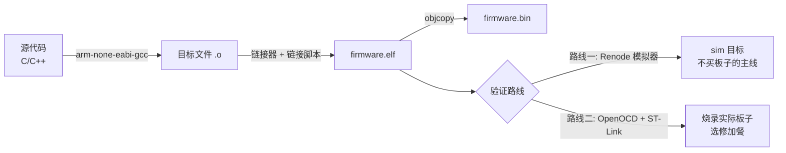

# 从零搭建 STM32 开发工具链

> 写给所有想在 Linux 下搞 STM32、却被一堆工具链名词搞得晕头转向的朋友。这篇带咱们把交叉编译的原理讲清楚,把每个工具的用途对上号,然后在 Ubuntu 和 Arch 两条路线下把它们装齐。

## 笔者为什么要离开 Keil

笔者实在绷不住 Keil 那套老旧的工作流了。都 2026 年了,还在用只能跑在 Windows 上的闭源 IDE,代码提示残废,调试界面像上个世纪的软件,关键是还占好几个 GB 的 C 盘空间。

最要命的是,笔者已经习惯了 Linux 下的开发环境：用bash/zsh而不是沟槽的powershell，使用 clangd 做补全,CMake 管构建,这套东西用在任何项目上，对我而言，都顺手得不行。

但事情没那么简单。当笔者第一次尝试在 Linux 下给 STM32F103C8T6(也就是那块十几块钱的 Blue Pill 开发板)烧程序时,发现网上的教程简直是一场灾难。有的还在用 Makefile 手写编译规则,有的直接掏出 PlatformIO 这种把一切都封装好的黑盒（嗯，可以说跟其他大伙交流了一下——使用评价是有点灾难）

还有的干脆说"你就用 Keil 吧,Linux 下折腾不划算"。最离谱的是那些所谓"从零开始"的教程,上来就给你一堆命令让你复制粘贴,完全不说 arm-none-eabi-gcc 是干嘛的、newlib 又是什么、为什么需要链接脚本。咱们照着做确实能跑通,但只要稍微出点问题,就完全不知道从哪下手排查。

笔者想让咱们的这一套，应该可以说是教程的教程，做到一个与众不同的点，那就是**模拟器先行**。

咱们用 Renode 模拟器当主要的开发验证环境,一块板子都不用买就能从头跟到尾;实际板子(Blue Pill)是每站末尾的选修加餐。所以工具链清单里,除了编译烧录那一套,还要多装一个 Renode。两条验证路线的关系,装完工具咱们就看得到了。

## 什么是交叉编译

OK，在咱们开始之前，咱们有必要说一下一个很重要，很重要的概念：交叉编译(它的英文名称是 Cross-Compilation)。

如果您平时写的是运行在 x86-64 CPU 上的普通程序,编译过程很直接:用 gcc 编译代码,生成的可执行文件也在同一台机器上运行。编译器和程序运行的目标平台是同一个,这叫"本地编译"(Native Compilation)。

但咱们的目标芯片 STM32F103C8T6 用的是 ARM Cortex-M3 核心,指令集和电脑上的 x86-64 完全不同。在电脑上用普通 gcc 编译出来的代码,STM32 根本读不懂,就像对着一个只懂中文的人念阿拉伯语。所以咱们需要一个"翻译官":一个运行在 x86-64 Linux 上、但能生成 ARM 机器码的编译器。这就是交叉编译器。

那为什么叫 `arm-none-eabi-gcc` 这么一长串奇怪的名字? 难不成咱们 GNU 选手都有起名癖？那倒不是。

仔细看看:`arm` 说的是目标架构,生成的代码给 ARM 用;`none` 表示没有操作系统,纯裸机;`eabi` 是 Embedded Application Binary Interface(嵌入式应用二进制接口)的缩写——ABI 是机器码层面的配合约定,参数怎么传、返回值搁哪、数据怎么对齐都按它来,两边约好同一套,编译产物才接得上;`gcc` 就是 GNU Compiler Collection 本尊。这下咱们懂了:在本机上编译,产出的机器码给 ARM 架构用。

`none` 这个字段原本用来标注操作系统厂商,比如 `arm-linux-gnueabihf` 表示给跑 Linux 的 ARM 设备编译。咱们的 STM32 跑裸机程序,没有操作系统撑腰,所以填 `none`。至于 `eabi` 和 `eabihf` 的区别,后者支持硬浮点调用约定——浮点参数直接放进 FPU(浮点运算单元,算浮点数用的硬件电路)的寄存器里传,不用软件模拟;F103C8T6 的 Cortex-M3 压根没有 FPU,用普通的 `eabi` 就对了(后面换到带 FPU 的 F407 时会再提这件事)。

理解交叉编译之后,咱们就明白为什么不能直接用系统自带的 gcc,也知道为什么需要一整套专门的工具:编译器、链接器、调试器、objcopy(把 ELF 转成二进制——ELF 是链接器产出的可执行格式,除指令外还带符号表和调试信息,.bin 剥掉这些壳,只剩指令和数据)、size(查看固件大小),这些工具都必须是"交叉版本"的。

## 整个工具链长什么样

在正式安装之前,咱们先把整体框架过一遍。编译一个 STM32 程序并验证它,流水线长这样:



路线一是这套教程的主线:咱们的 ELF 文件直接喂给 Renode,模拟器里跑起来、验证行为,不依赖任何硬件。路线二是传统路线:objcopy 把 ELF 提炼成纯二进制,OpenOCD 通过 ST-Link(ST 官方的调试器小硬件,一头插电脑 USB、一头接板子的调试口,烧录调试的电信号都从它身上过;Blue Pill 配套的兼容款十几块钱)把它写进芯片的 Flash。两条路线用同一份代码、同一个构建产物,差别只在最后一步怎么执行。

流水线中间那一步(目标文件拼成 ELF)由链接器完成,这一步在 STM32 上有讲究:普通程序跑在操作系统里,内存布局有人操心;裸机程序没人管——Flash 是芯片里断电不丢的存储,程序烧进去住这儿、上电也从这儿开跑,RAM 断电即空、跑起来才装变量和栈,它们各从哪个地址开始、堆栈怎么分配,得咱们自己写清楚交给链接器。这些信息就写在链接脚本(`.ld` 文件)里,链接器照着这张"地图",把代码段、数据段放到正确位置。

标准库又是哪来的?咱们平时在电脑上写 C++,背后是 glibc,可它是给操作系统环境设计的,依赖一堆系统调用,裸机上没有操作系统伺候它。所以 ARM 工具链配的是 newlib,一个专门为裸机设计的 C 标准库实现;咱们实际用的是它的精简版 newlib-nano,针对代码体积做了优化。装好它,`<stdint.h>`、`<string.h>` 这些头文件才有得引用。

使用实际板子开发时,OpenOCD(Open On-Chip Debugger)一人分饰两角:一是把固件写进 Flash(烧录),二是充当 GDB Server,让您用 GDB 调试板子上的程序。模拟器这边,Renode 自己就能提供 GDB 接口,调试篇会讲到。

## Ubuntu 路线

笔者以 Ubuntu 22.04 LTS 为例,20.04 和 24.04 命令基本一致。打开终端,先更新包索引:

```bash
sudo apt update
```

然后把需要的包装上:

```bash
sudo apt install -y \
    gcc-arm-none-eabi \
    gdb-multiarch \
    openocd \
    cmake \
    build-essential
```

咱们把这几个包挨个说清楚。`gcc-arm-none-eabi` 是个大礼包,里面包含交叉编译器、链接器、objcopy、size 等一整套工具。`gdb-multiarch` 是多架构版的 GDB,能调 ARM 也能调 RISC-V——注意它装出来的可执行文件就叫 `gdb-multiarch`,不是 `arm-none-eabi-gdb`(Ubuntu 早就把老包移出源了)。本教程后面凡是写 `arm-none-eabi-gdb` 的地方,Ubuntu 用户替换成 `gdb-multiarch` 即可。`openocd` 负责往实际板子上烧录和调试。`cmake` 和 `build-essential` 是构建工具。

Ubuntu 源里没有 Renode,官方提供的是自己的 deb 仓库和便携包,到 [renode.io](https://renode.io) 的下载页按指引装即可。您装好后在终端里敲 `renode --version` 能出版本号就行。

## Arch Linux 路线（笔者探头）

如果您用 Arch Linux(或 Manjaro),包管理更直接,软件也新:

```bash
sudo pacman -S arm-none-eabi-gcc arm-none-eabi-binutils arm-none-eabi-gdb openocd cmake make
```

和 Ubuntu 不同,Arch 把工具拆成了多个包,咱们得自己拼齐:`arm-none-eabi-gcc` 是编译器,`arm-none-eabi-binutils` 包含 ld、objcopy、size,`arm-none-eabi-gdb` 是调试器。Renode 在 AUR 里:

```bash
yay -S renode
```

这里有个坑要提前预警。咱们在 Arch 上装完 `arm-none-eabi-gcc` 后,编译时可能找不到 `<stdint.h>`,或者链接时报 `cannot read spec file 'nano.specs'`。原因都一样:Arch 的 `arm-none-eabi-gcc` 包不包含 newlib,需要额外装 AUR 的:

```bash
yay -S arm-none-eabi-newlib
```

咱们装完 newlib,`nano.specs` 和 `nosys.specs` 才能正常使用。这两个 specs 文件是干嘛的?`nano.specs` 告诉链接器用 newlib-nano(精简版 C 库),`nosys.specs` 提供一套空的系统调用存根——裸机环境没有操作系统,`read()`、`write()` 这类函数根本没法实现,nosys 让链接时不报错。

## 装完先验收

装完之后咱们别急着往下走,先把验收做了。这套教程里后续每篇文章的实验,都默认这几条命令能出东西:

```bash
arm-none-eabi-gcc --version
renode --version
cmake --version
```

笔者本机(Arch,WSL2)的真实输出:

```text
arm-none-eabi-gcc (Arch Repository) 16.1.0
Renode v1.16.1.16973
cmake version 4.4.2
```

版本号和您的不一样很正常,工具链是滚动的。只有一条建议:尽量用近几年的版本,GCC 13 以下可能在某些 C++23 特性上跛脚,clangd 那套配置(第 7 篇)也要求 clangd 17+。手头有实际板子的朋友,顺手把 `openocd --version` 也验一下;没有板子?完全不影响,下一篇咱们就在模拟器里把第一盏灯点起来。
