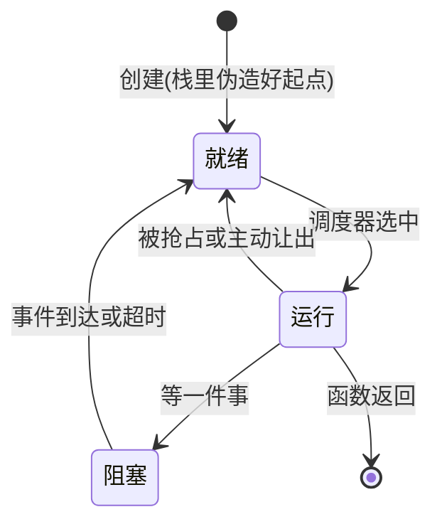

# 从一万个零散的业务代码到RTOS串起组织的项目——为什么我们极端复杂的多业务项目需要RTOS

兄弟们，咱们写一个普通的嵌入式项目，不可能只是简简单单的点几盏灯。他们很有可能具备复杂的逻辑，比如说需要高精度的，基于定时器消抖的按钮检测方案（比如说就是20ms查一次）；或者是在调式模式下使能的 UART 调试日志（断收进环形缓冲,得有人取走，不能被阻塞或者是丢失）；或者是业务代码需要以100ms 要读一次数据，跨越任务投递到UI线程，到一个点亮的OLED上。。。之前没有RTOS这个东西的时候，我们写在了一个 `int main()` 中，而且还放进了 `while (true)`。

然后写着写着，咱们笑不出来了——

```cpp
int main() {
    uart1_init();
    uint32_t last_sample = 0;
    while (true) {
        oled_refresh();                          // 阻塞刷屏,50ms 走不掉
        if (tick - last_sample >= 100) {         // 传感器:每 100ms 读一次
            sensor_sample();
            last_sample = tick;
        }
        button_poll();                           // 按键消抖,内部自己记时间
        cli_process(uart_try_read());            // 命令解析,没字节就空转
        // 下面可能还有几百行代码，忘记看哪个非RTOS版本的项目了，我只能说我大为震撼
    }
}
```

大家都知道，`button_poll` 是一个按钮轮询回调（具体怎么写麻烦发动大脑思考），意味着这是一个很经典的同步操作，最经典的同步操作是要让CPU忙等待的

> 哦类似协程等看起来是同步，本质是异步的，所以不是写起来和看起来像是同步操作，他就是同步的，需要看当前的逻辑任务线是否放弃了CPU退居后台，这一点笔者遇到有人居然在这里有疑问，特别说明一下。

问题来了，如果咱们但凡在中间做一点耗时的同步操作，这个循环就废了——比如说，笔者在循环里塞一个 `badCode()`，不知道干什么事情拖延你200ms，那么所有的检测都要依次向后延200ms，对于追求实时性的场景，兄弟们，这就是裂开级别的打击。但是这种前后台模式却就是这样的脆弱——你没有办法，只能看着任何一个功能变慢的时候，平等的惩罚循环里所有其他的功能,它们的最坏响应时间就是整圈循环的耗时。没有哪一行代码写错,是结构就这样。

`foreground/background system`，就是这个意思。这里的中断是前台,事件随到随办;`main` 循环是后台,所有慢活排队轮询。您在 F103 线用的就是这套结构。系统小的时候它简单直接;上面这些结构性问题,是系统变大之后才显出来的。

## 所以，怎么办

嵌入式很多场景追求实时性，但很遗憾，这套方式恰好就不保证响应时间。上面已经算过:循环里最长的阻塞决定了其他所有逻辑的最坏响应时间。您把 OLED 刷屏拆细点?可以,但下一个耗时的操作进来,最坏响应又被顶上去。它随功能数量单调变差,而且没有任何机制约束它。

优先级，那也是也没有。您的系统肯定要有先后处理顺序，顺序性的，细水流长的while循环让后台任务一律被真正的平等对待。处理越界报警的代码和刷动画的代码排同一条队,谁排前面全凭 `while` 里的书写顺序,紧急与否不参与意见。等到真出事了，你真的就只能看着代码慢悠悠的转在按钮监听轮询，而不去处理告警的逻辑。

我已急哭就是这个道理

> 您可能想问,中断不是有优先级吗?有,但 ISR 里不敢久留,重活得交回后台处理;一交回队,又平等了。他根本没办法根治，说一千道一万，流水的轮询代码害了咱们。

最麻烦的是同步。中断和循环共享的数据,环形缓冲的读写指针、tick 计数、各种标志位,要么关中断保护,要么精心设计访问次序。关长了,串口字节和系统 tick 都会丢;关短了,竞态留在代码里,什么时候发作不确定。F103 线的环形缓冲咱们已经手工处理过一小块,那是单个外设的量;外设多起来,每处共享都得再来一遍,而且一次都不能错。笔者自己看见过的嵌入式的石山代码（说的就是我自己的）崩塌了就是因为添加了一个新的定时器，业务逻辑把里面的状态机打碎了。

## 手写状态机——可以说是一种最简单的处理办法

咱们别把前后台系统说成错误。两三件慢活、没有实时要求的小系统,它就是最合适的形态。真有一两个耗时操作,也不必上 RTOS,消抖状态机就是现成做法:把 50ms 的阻塞等待拆成"现在做什么、下次回来接着做什么",循环里每件事只跑一小步就返回,响应就回来了。

您把手写状态机想深一层,会发现它在手工模拟一个协作式调度器:每个状态机就是一个不占栈的"任务",主循环就是在轮询调度它们。这个方案在中小系统里完全够用,很多产品一辈子就用它。毕竟我们不能指望更小的片子处理更大的任务了，那就要在硬件上雕刻，笔者称之为真正的老艺术家（赞赏.png），

但是为什么还是有RTOS呢，状态机不好嘛？您这一问，可就不好了。状态机的编程从来都很令人烦躁，他的维护复杂度在每增加一个新的节点的时候，但凡没拆好，完全没办法维护了就要！这就是说我们要做更多的事情的时候，比如说——时间要等、字节要等、总线空闲要等、几个设备的事件要组合着等,每种等待都要写进状态机的状态里,状态数按组合往上涨,改一处牵三处。孩子你就改吧，太阳落山前搞定笔者高低给你点一个——天生的Mount Shit Forger。

得了，不干了！我们坐下来思考一下——问题就在于，我们把抽象的“调度”和业务代码混合在了一起，没有做任何程度上的解耦合。上面的状态机抽象，对于一个十几个任务混合而言，就是不优雅的抽象，所以如何优雅的写代（Mount）码(Shit)呢？

答案是——把"等"从每个状态机里抽出来,交给一个专职模块统一管理。这个模块就是调度器;以调度器为核心,加上任务、同步、时间服务、中断后半段，这——就是一个最基本的RTOS。

好了给自己鼓个掌，您发明了最简单的OS了。

## RTOS 把等待交给内核

所以别被RTOS吓到了，RTOS诞生之初只是考虑一个事情——给我们该死的任务赶快解耦合调度和干活本身。好像我们回到了美好的上位机编程时代，底层的操作系统帮助您进行调度，您只管干活和睡大觉或者是告诉CPU嘿哥们我要睡大觉了，您佬麻溜点把CPU时间提给别的伙计，他们很饥渴难耐。

但是，代价是什么？那就是我们就要直面被解耦合的——调度和等待本身，我们要学上位机的线程，要有自己的栈，要有自己的CPU上下文寄存器。屁话少点的说辞就是——我们干事情留下的上下文，被我们用到一半的工具脚手架图纸焊道一半的PCB，请大哥您收好他，下一次您再来的时候接着干。就这个意思。

"收好、下次接着干",咱们顺着这句话往下问:一个任务为什么不在 CPU 上跑?无非两种原因——CPU 让给了别的任务,现场收着,随时能接着干;或者它自己在等一件事,等的东西不到,想接着干也接不上。再加上正在跑的那一个,任意时刻每个任务都处在三个状态之一,来回转换:



图里"创建(栈里伪造好起点)"这个标注值得咱们提前说一句:新任务从来没运行过,它的栈里得有人替它伪造一份"正在被中断打断"的现场,第一次切换才能把它当作"恢复"来处理。为什么这么写？嘿嘿，这是一个秘密，耐心等待他的揭晓~。

上面咱们是不是说过，响应时间？对，就是前后台那一节咱们念叨的那个最坏响应：跟整圈循环捆在一起，功能加一个、全体慢一截，当时咱们一点办法没有。现在调度交给内核，CPU 谁上谁下由优先级说了算，这个老问题就值得重新问一遍：换了 RTOS，最坏响应由什么决定？

响应时间的量级差别就在这里。前后台系统里,紧急逻辑的最坏响应由整圈循环决定;有了优先级抢占,最坏响应由"最长临界区加一次切换"决定。对比 50ms 级的循环,咱们一瞅——好家伙能差四个数量级。

为什么会这样呢？明明单条指令的执行时间没有变啊？嘿嘿，答案是 CPU 的分配规则我们做了很大的优化！高优先级任务一就绪,低优先级任务就立马退位：恭喜你！你现在终于不用咬牙切齿的看着沟槽的按钮轮询阻碍你老板让您写的报警逻辑了（手动放烟花）

那中断呢？其实还是前台，这个玩意是硬件级别的响应的。中断一来，中断的处理芯片就一巴掌把CPU打到中断上下文，指着他的鼻子说——小朋友，咱们有硬件来活了，最好光速处理，外面排着队呢！所以他还是前台，没招。但是 ISR 处理程序现在制作一个事情——快速的把响应塞给了（好吧，如果您在面试或者正在给其他严肃的同事介绍这个概念，还请您使用事件投递(Post An Event)这个词），自己立马返回了。

瞧瞧！上位机开发的朋友就立马跳起来——兄弟们咱们这个熟悉啊，你在硬件层次把一个任务从同步处理改成了异步处理！是的。我们把中断处理这个事情立马分割为更加清晰的上下两半，而曾经我们是要自己处理的。那就是上半段（Top Half）：响应一个中断（告诉片子，我，CPU，已阅，您佬滚去继续接受中断）和处理一个中断的后续(Bottom half)，Linux也有类似的机制，但是这里是RTOS，知晓Linux的中断处理机制（类似softirq那套）的朋友，还请您坐下稍安勿躁。

## 为什么是 C++23？您老写OOP？

不是，C++是一个泛型编程语言，不是一个OOP语言，我们这里的C++特性，聚焦多于泛型概念而非一个抽象基类。请这个事情大伙务必记一下。如果我后面行文抽风了，还请踹我一脚。

我不选**C++的OOP范式的原因是**他的低开销非常依赖编译器的优化手段，我们大可以写 `struct CortexM3System : public ISystem` 然后实现他的所有抽象接口。但是很显然，我一分钱都不想付给任何场景下的编译器设置。包括他头部的基类空间。**如果已知，一分钱都不要付——ZerOS想试试看做这个。（这也是笔者力所能及的搞一大堆static_assert判定平凡对象的原因）**

> 您知道的，嵌入式最厌恶不确定性。那就不要用。尽管我知道咱们编译器的优化一拉高，**虚表都能给您扬咯**，但是我们不能指望所有的编译器都是这样的。请把问题留给自己而不是使用您项目的人，是我一直争取做到的。

扯远了，回来，咱们跑的片子可能很脆弱，比如说 STM32F103C8T6 ，笔者记性不太好，查资料不太利索，20KB RAM, 64KB Flash，我应该没说错。不是很够我们玩。

> 剧透，好在后续自己的Flash LED电灯体积3KB，现代的C++的魅力如此。

所以，我们说我们要的是 freestanding 环境,无堆、无 RTTI、无异常,这三样是 ZerOS 主动禁用的。下一篇您会看到禁令写进链接脚本,谁引入堆 `new` 或异常,链接器直接报错拦下。

深呼吸，选择C++23而不是C++20, 17, 14或者是11，我有理由。

concepts是C++20出现的，笔者等到23支持更加成熟了，选的。concepts(C++20)把接口约束写成编译器可检查的形式:调度器对移植层的要求写成一个 concept,移植实现少一个函数,`static_assert` 当场失败,接口文档从注释变成编译器亲自执行，笔者一分钟都不想看到运行的时候从串口扭扭捏捏的给我来一句——“私密马赛，这个不可以，传错东西了”。我的评价是滚蛋，我要让clangd起手飘红线！

另外一个决定性的真是——`std::expected`(C++23)把错误放进返回值:没有异常可抛的世界里,"要么结果、要么错误码"是函数返回类型的一部分,配 `[[nodiscard]]`,忽略错误的代码编不过,第一站的内存池全程用它。

> 碎碎念，笔者之前记差了，居然说std::expected是C++20的，果不其然被喷没写过代码，加班害人，人生远离互联网。

可能是最后一个——我们的全局对象一律 `constinit`,编译期就位,没有初始化顺序问题,也没有藏在背后的堆分配。

啥？那就一点C没有，也不是——我说过：“不确定的钱，不知道要不要付，那就一分钱不要付”。所以切换、入队、唤醒的代码,那些是朴素的静态 C 风格,能数得清周期。尝试任何编译器都要打出来数的Instructions都是确定的，映射到消费的CPU Cycles是精准的。这才比较好。（虽然我写急眼了也是Runnable First）

## 喘口气，休息一下

好了兄弟们，休息一下吧！下一站开始，就是笔者周五那天的奇思妙想开始——动手搭建我们的ZerOS，让一个独属于你的RTOS也在板子上亮起来啊啊啊啊啊啊不是芯片啊啊啊啊啊啊。
